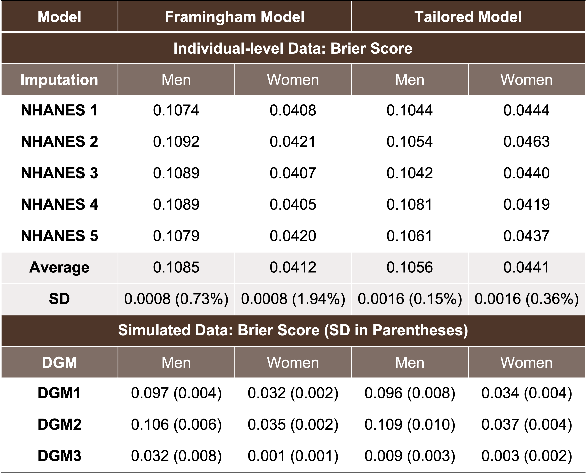
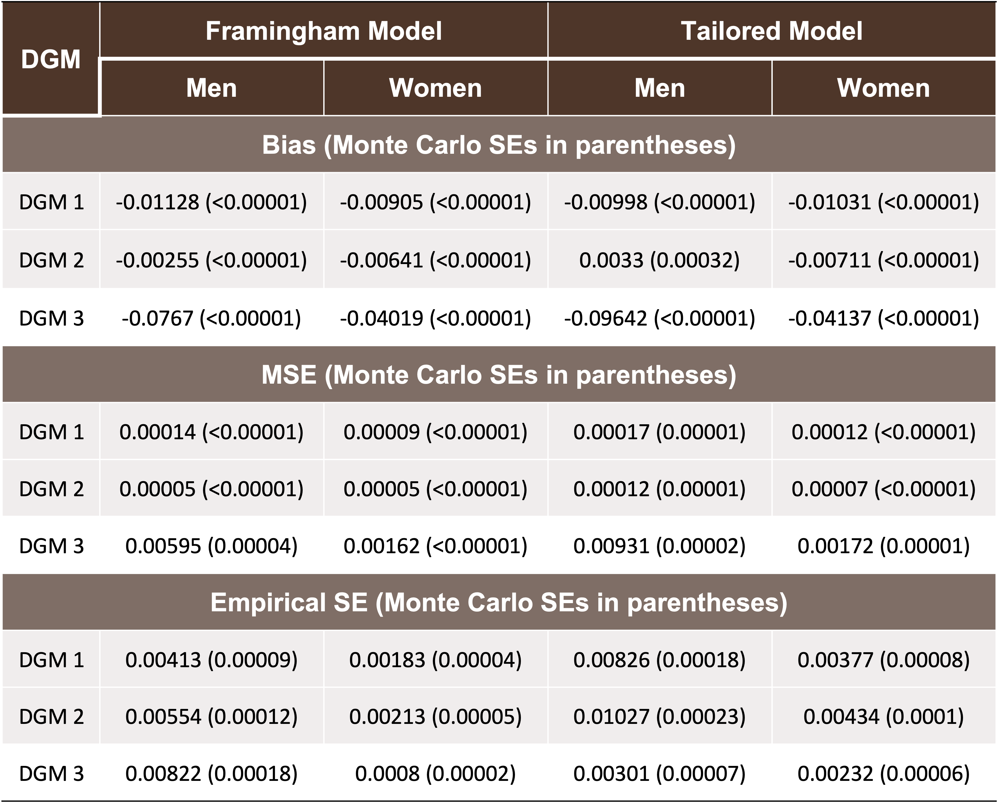

# PHP2550 Practical Data Analysis: Final Portfolio
## Description

## Project 1
### Overview
Exposure to smoking during pregnancy and environmental tobacco smoke are two of the most ubiquitous and hazardous of children's environmental exposures. Early smoke exposure is linked to externalizing behaviors, self-regulation problems, and substance use. This project aims to conduct exploratory data analysis to examine the associations between smoking during pregnancy, environmental tobacco smoke exposure, and self-regulation, externalizing behavior, and substance use in adolescents. Please see `Project Highlights` for visualized results. 

 Abstract

Background: Exposure to smoking during pregnancy and environmental tobacco smoke are two of the most ubiquitous and hazardous of children's environmental exposures (Micalizzi 2023; Paul 2023). Early smoke exposure is linked to externalizing behaviors, self-regulation problems, and substance use. This project aims to conduct exploratory data analysis to examine the associations between smoking during pregnancy, environmental tobacco smoke exposure, and self-regulation, externalizing behavior, and substance use in adolescents.  

Methods: Population in this study were recruited from a previous study on smoke avoidance intervention, aimed at reducing low-income women's smoking and environmental tobacco smoke exposure during pregnancy, as well as children's exposure to environmental tobacco smoke in the immediate postpartum period. A subset of adolescents (N=100) and their mothers were randomly selected for recruitment into this current study. After preprocessing, we described the missing data pattern, conducted univariate analyses of demographic variables, smoking exposure variables, and variables related to externalizing, self-regulation, and substance use; intercorrelations were then analyzed. Bivariate analysis was conducted to meet the project's research goals.  

Results: The data accessed is the baseline data for the current study, including self-regulatory assessments, self-reported substance use, self-regulation, and EKG. After preprocessing, 49 observations of 78 variables were available. Significant missing data affected the exploratory data analysis. In terms of interrelationships, we found that prenatal and postnatal smoke exposure are mildly positively correlated. For variables related to self-regulation, externalizing, and substance use, some showed strong intercorrelations, respectively. Bivariate associations indicated that smoke exposure during the 2nd to 5th year is significantly associated with expressive suppression. For externalizing problems, smoke exposure from 0 to 6 months was associated with attention problems, externalizing problems, and two types of ADHD; prenatal smoke exposure was associated with attention problems evaluated by parents and ADHD - Hyperactive/Impulsive type.  

Conclusions:  Based on bivariate analysis, different stages of early smoke exposure are associated with self-regulation, externalizing problems, and substance use, respectively. Further studies should consider improving the sample size and the quality of the data to obtain more powerful statistical associations.   

Keywords: Smoking during Pregnancy, Environmental Tobacco Smoke, Externalizing Behaviors, Self-regulation, Substance Use  

### Project Highlights
The plots of bivariate analysis are highlighted here.   
Smoke exposure during 2nd, 3rd, 4th and 5th year versus expressive suppression: 
  
Prenatal exposure intensity and externalizing problems:   
  
Smoke exposure from 0 to 6 months versus externalizing problems:   
   

### Acknowledgement
This project is a collaboration with Dr. Lauren Micalizzi from the Department Behavioral and Social Sciences at Brown School of Public Health. 

### Data Availability
The data of this project is confidential. It can only be shared with the instructor, students, and TA of this class. The data is not included in this github repository.

### Environment Version Information

 R Environment

- R_4.1.2
- tidyverse_1.3.2  
- kableExtra_1.3.4  
- gtsummary_1.7.2  
- latex2exp_0.9.6  
- ggpubr_0.4.0  
- mice_3.15.0
- naniar_1.0.0
- tableone_0.13.2
- psych_2.2.9
- GGally_2.1.2

### Guideline for Project 1 in this repository
Files are in the `Project 1 Exploratory Data Analysis` folder. The `report` folder includes the updated report `Project-1_updated.pdf` and the code for generating this report called `Project-1_updated.Rmd`. The `code` folder includes the pre-processing code `pre-processing.R` and exploratory data analysis code `EDA_code.R`. The references `references.bib` in BibTeX can be found in the `references` folder. 

## Project 2
### Overview
In this project, we developed the prediction model of tracheostomy placement or mortality for infants possibly suffering from severe bronchopulmonary dysplasia. Previous models have utilized only baseline demographic information and clinical diagnoses without considering comprehensive respiratory parameters at various postmenstrual ages. This study aims to address this research gap by incorporating respiratory parameters at 36-week postmenstrual ages to predict tracheostomy or death in infants with severe bronchopulmonary dysplasia. We fitted both the fixed-effect and the mixed-effect model with random intercept for medical center indicators. The final models provide an earlier and more accurate prediction of the need for tracheostomy in infants with severe BPD at early postmenstrual ages. This has potential implications for counseling families, optimizing tracheostomy placement, and improving infant growth outcomes.  

 Abstract

Background: Tracheostomy placement in infants suffering from severe bronchopulmonary dysplasia presents a clinical challenge due to the absence of clear indication criteria and optimal timing. Previous studies predicting the likelihood of tracheostomy placement or mortality have utilized only baseline demographic information and clinical diagnoses without considering comprehensive respiratory parameters at various postmenstrual ages. This study aims to address this research gap by incorporating respiratory parameters at 36-week postmenstrual ages to predict tracheostomy or death in infants with severe bronchopulmonary dysplasia (Paul 2023).    

Methods: The data is a national data set of birth, demographic, diagnostic, and respiratory parameters of infants with severe bronchopulmonary dysplasia admitted to collaborative NICUs and with known respiratory support parameters at 36-week postmenstrual ages. Variables with a high proportion of missing data were excluded, and the remaining were imputed using multiple imputation techniques. Fixed-effect and mixed -effect logistic regression models were developed to predict the likelihood of tracheostomy or death, applying two variable selection methods: best subset selection and Lasso regularization.   

Results: A total of 985 records were included in the final analysis, with 80% (N=794) for training and 20% (N=191) for testing. The final models, including one fixed-effect model for usage within existing facilities and another mixed-effect model for broader application, demonstrated excellent performance. The inclusion of diagnostic and respiratory parameters at 36-week PMA proved valuable for predicting the likelihood of tracheostomy or mortality. The fixed-effect model achieved an area under the curve of 0.9106, with sensitivity of 0.8485, specificity of 0.8582, accuracy of 0.8565. The mixed-effect model achieved an area under the curve of 0.9079, , with sensitivity of 0.8303, specificity of 0.8620, accuracy of 0.8565.   

Conclusions: The models incorporating respiratory parameters at 36-week postmenstrual ages provide an earlier and more accurate prediction of the need for tracheostomy in infants with severe BPD at early postmenstrual ages. This has potential implications for counseling families, optimizing tracheostomy placement, and improving infant growth outcomes.  

Keywords: Tracheostomy, Regression Analysis, Respiratory Parameters

### Project Highlights
Model performance:   
|                  | Best Subset (Fixed-Effect) M1 | Best Subset (Mixed-Effect) | Lasso (Fixed-Effect) M2 | Lasso (Mixed-Effect) |
|------------------|-------------------------------|----------------------------|-------------------------|----------------------|
| **AUC**          | **0.9106**                    | **0.9079**                 | 0.9068                  | 0.9054               |
| **Sensitivity**  | **0.8485**                    | **0.8303**                 | 0.8000                  | 0.8121               |
| **Specificity**  | **0.8582**                    | **0.8620**                 | 0.8646                  | 0.8456               |
| **Accuracy**     | **0.8565**                    | **0.8565**                 | 0.8534                  | 0.8398               |
| **Precision**    | **0.5556**                    | **0.5569**                 | 0.5523                  | 0.5234               |
| **Brier Score**  | **0.0870**                    | **0.0865**                 | 0.0898                  | 0.0899               |
| **Threshold**    | **0.1873**                    | **0.1873**                 | 0.1990                  | 0.2063               |

### Acknowledgement
This project is a collaboration with Dr. Chris Schmid in the Department of Biostatistics, Brown University School of Public Health. The instructor is Dr. Alice Paul from Department of Biostatistics, Brown University School of Public Health.

### Data Availability
The data of this project is confidential. It can only be shared with the instructor, students, and TA of this class. The data is not included in this github repository. 

### Environment Version Information

 R Environment

- R_4.1.2
- tidyverse_1.3.2  
- kableExtra_1.3.4  
- gtsummary_1.7.2  
- latex2exp_0.9.6  
- ggpubr_0.4.0  
- mice_3.15.0  
- psych_2.2.9
- glmnet_4.1-6  
- L0Learn_2.1.0  
- pROC_1.18.0  
- ggplot2_3.4.2
- lme4_1.1-31

### Guideline for Project 2 in this repository
Files are in the `Project 2 Regression Analysis` folder. The `report` folder includes the updated report `Project-2_updated.pdf` and the code for generating this report called `Project-2_updated.Rmd`. The `code` folder includes the pre-processing code with exploratory data analysis called `pre_processing_EDA_updated.R`; the code for best subset selection can be found in `best_subset_updated.R`; the code for Lasso regression can be found in `lasso_updated.R`; the code for mixed-effect models is in `multilevel.R`; `evaluation_updated.R` provides functions for the model performance evaluation. The references `references.bib` in BibTeX can be found in the `references` folder. 

## Project 3: Assessing the Transportability of a Cardiovascular Disease Event Model Constructed from the Framingham Heart Study to the NHANES Dataset
### Overview
In this project, we analyzed the transportability of a cardiovascular disease (CVD) event model, which was fitted using Framingham data, to the extensive national NHANES dataset. We assessed this by using the Brier Score, both when individual-level data were available and when they were unavailable, through simulation.

Abstract

Background: Assessing transportability is of importance when users of prediction models are interested in applying model-derived predictions to some different target populations. In recent years, several methods have been developed to evaluate the performance of prediction models in a target population (Paul 2023; Steingrimsson et al. 2023). In this study, we are interested in transporting the model for cardiovascular disease events constructed from Framingham Heart Study data to the more extensive National Health and Nutrition Examination Survey data.   

Methods: When the target population's covariates were available, we utilized multiple imputation to address missing data and then calculated the Brier score in NHANES data with both the original Framingham model and the tailored model, straitified by sex.  Additionally, when only summary data were available from the target population, simulation studies are conducted by drawing random samples using the summary statistics of the target population, and the Brier score was then calculated.   

Results: The Brier score of original Framingham model averages 0.1085 for men and 0.0412 for women, and the Brier score of tailored model averages 0.1056 for men and 0.0441 for women in NHANES population, which are about 50% of the Brier score validated on Framingham data themselves. The results of Brier score from simulation studies are close to the Brier score calculated using individual-level data directly.  

Conclusions: The results indicate the excellent performance of transporting the model constructed from Framingham data to the national NHANES data. Moreover, the simulation studies indicate when only summary data are available, the transportability analysis is workable and promising.   

Keywords: Transportablity, Cardiovascular Disease Events, Framingham Heart Study, NHANES

### Project Highlights
Transportability Analysis:  
    
Simulation Performance:   
 

### Acknowledgement
This project is a collaboration with Dr. Jon Steingrimsson in the Department of Biostatistics, Brown University School of Public Health. The instructor is Dr. Alice Paul from Department of Biostatistics, Brown University School of Public Health.

### Data Availability
This data for this project is all publicly available. The data is obtained from R packages riskCommunicator_1.0.1 and nhanesA_0.7.4.

### Environment Version Information

 R Environment

- R_4.1.2  
- tidyverse_1.3.2  
- kableExtra_1.3.4  
- gtsummary_1.7.2  
- latex2exp_0.9.6  
- ggpubr_0.4.0  
- mice_3.15.0  
- psych_2.2.9  
- riskCommunicator_1.0.1  
- nhanesA_0.7.4  
- tableone_0.13.2  
- caret_6.0-93  
- MASS_7.3-58.2  
- fitdistrplus_1.1-8

### Guideline for Project 3 in this repository
Files are in the `Project 3 Simulation Studies` folder. The `report` folder includes the updated report `Project3_updated.pdf` and the code for generating this report called `Project3_updated.Rmd`. The `code` folder includes the pre-processing code with exploratory data analysis called `project3_updated.R`, the code for calculating the Brier score when the individual-level data of NHANES are available called `evaluation_updated.R`, and the code for simulation studies called `simulation_updated.R`. The references `references.bib` in BibTeX can be found in the `references` folder. The pre-processed data can be found in the `pre-processed data` folder. The poster for this project is in the `poster` folder. 
